# GW2 Overlay

Modulær overlay for Guild Wars 2. Et lite hjul ligger over spillet og åpner moduler i et panel. Appen kjører lokalt og henter data fra GW2 API-et og wikien, samt oppdateringer fra GitHub og ArcDPS. Lokal AI er standard; sky-AI er valgfritt. DPS-logger lastes bare opp til dps.report når du trykker «Last opp».

Moduler: **Inventory** (rådgiver med lokal AI), **I dag** (Wizard's Vault, world bosses, fraktaler, kister), **Tidsplan** (world bosses og meta-events med waypoint rett i chatten), **Trading Post**, **DPS** (fra ArcDPS-logger), **Karakterer** (utstyr og AI-vurdering), **Guild** og **Innstillinger**.

Skal du utvikle på appen, eller sette en AI-agent på den: les [AGENTS.md](AGENTS.md) først. Der står oppsettet, reglene, utgivelsesløypa og alt vi har lært om ArcDPS.

## Skjermbilder

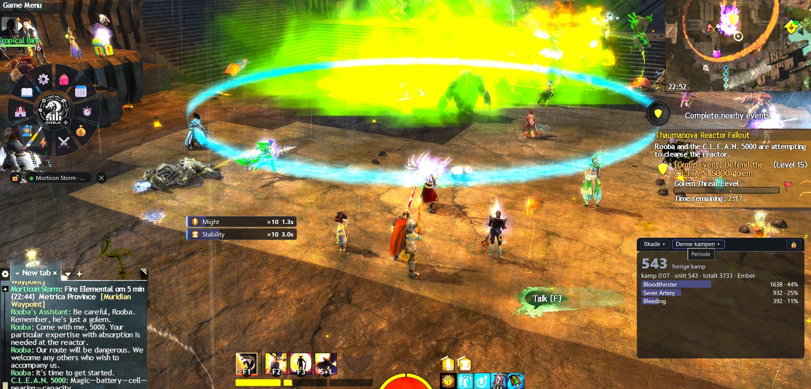

<table>
<tr><td width="50%" valign="top">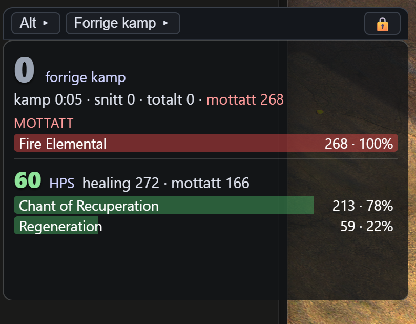<br><sub>DPS-måler, visning «Alt»: skade, mottatt og healing for forrige kamp</sub></td><td width="50%" valign="top">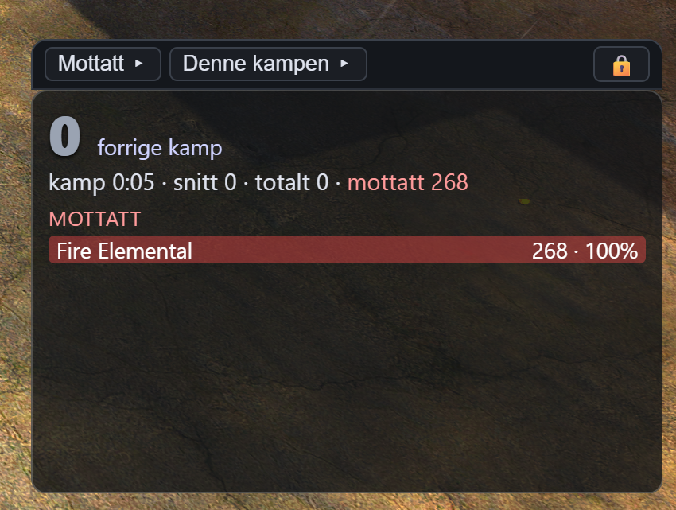<br><sub>Visning «Mottatt»: hvem som traff deg, per kilde</sub></td></tr>
<tr><td width="50%" valign="top">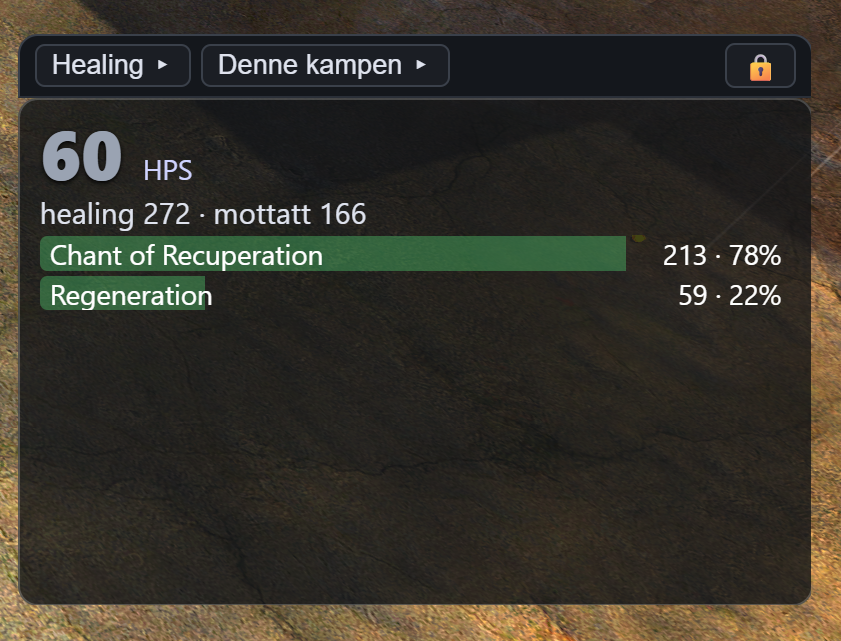<br><sub>Visning «Healing»: HPS og healing per skill</sub></td><td width="50%" valign="top"><br><sub>Ulåste overlay-vinduer dras og strekkes der de ligger</sub></td></tr>
<tr><td width="50%" valign="top">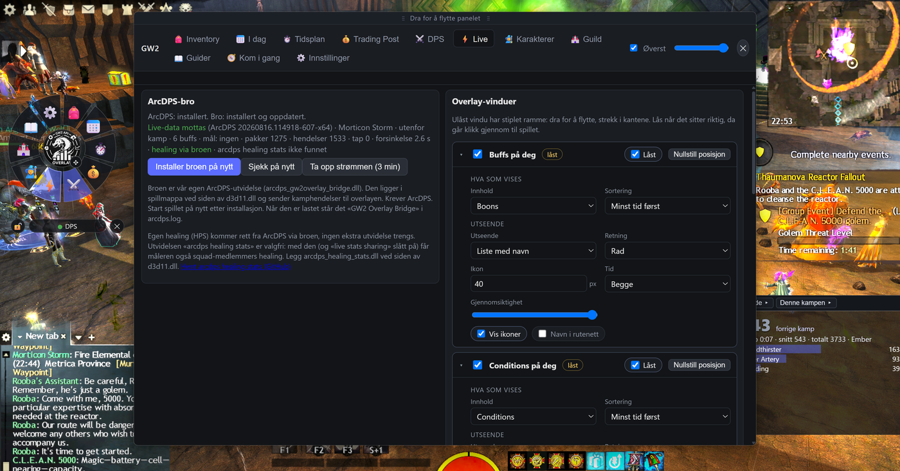<br><sub>Live-fanen: status for broen og ett kort per overlay-vindu</sub></td><td width="50%" valign="top">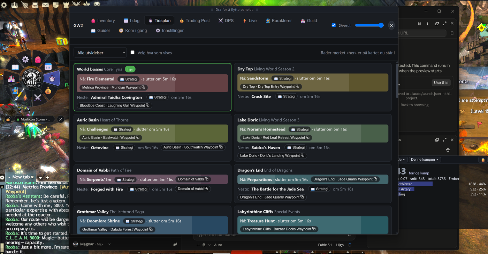<br><sub>Tidsplan: nå og neste per kart, waypoint limes i chatten</sub></td></tr>
<tr><td width="50%" valign="top">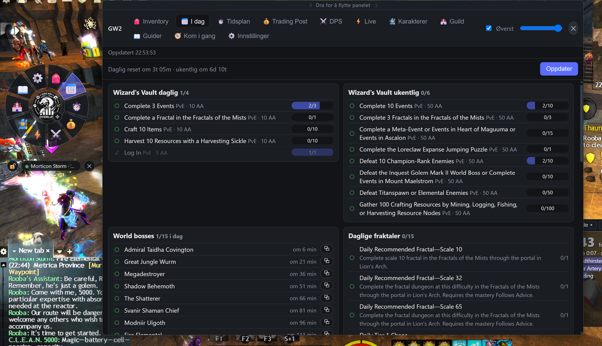<br><sub>I dag: Wizard's Vault, world bosses drept i dag, daglige fraktaler</sub></td><td width="50%" valign="top">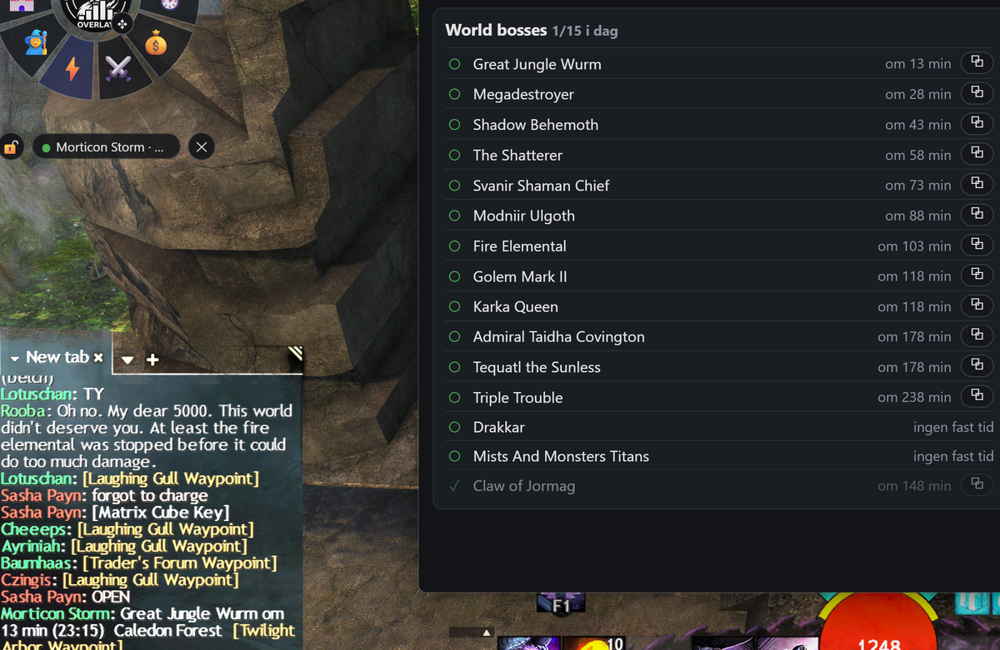<br><sub>I dag, world bosses: ett klikk limer inn navn, tid og waypoint</sub></td></tr>
<tr><td width="50%" valign="top">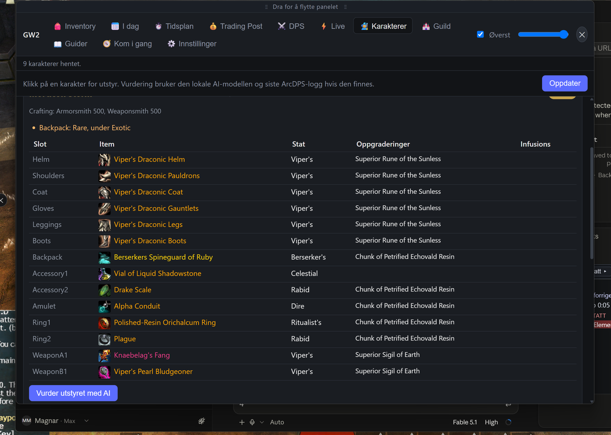<br><sub>Karakterer: utstyr per karakter med stats, runer og infusions</sub></td><td width="50%" valign="top">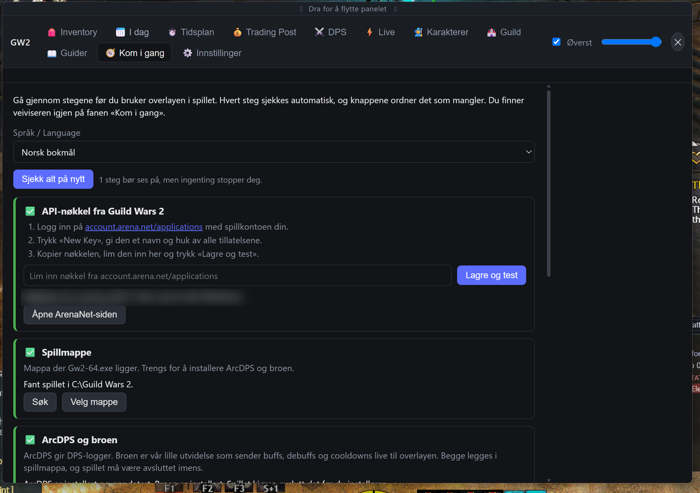<br><sub>Kom i gang: hvert steg sjekkes, knappene ordner det som mangler</sub></td></tr>
<tr><td width="50%" valign="top">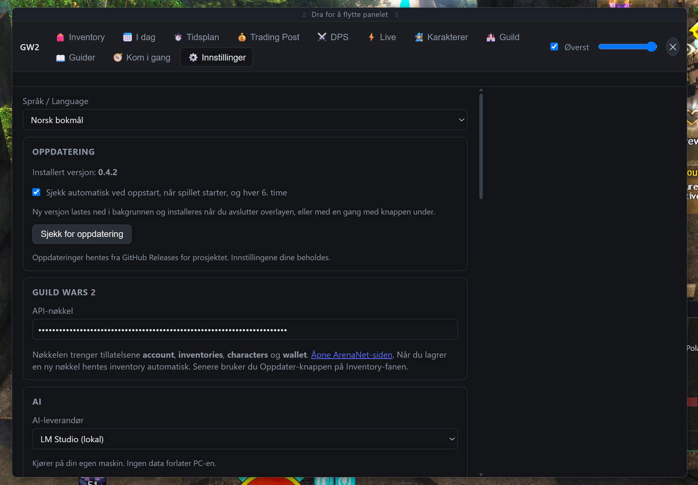<br><sub>Innstillinger: oppdateringskortet øverst, API-nøkkel, AI-leverandør</sub></td><td width="50%" valign="top">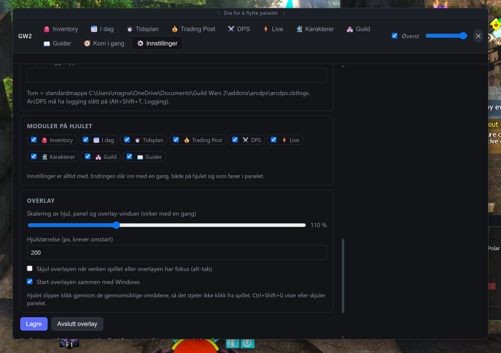<br><sub>Innstillinger: moduler på hjulet, skalering, start med Windows</sub></td></tr>
</table>

## Kom i gang

```bash
npm ci
npm start
```

1. Første gang åpner panelet fanen *Kom i gang*: en veiviser som sjekker API-nøkkel, spillmappe, ArcDPS og broen, loggmappe, oppstart sammen med spillet, hjelperen og LM Studio, med knapper som ordner det som mangler. Den ligger alltid som fane ved siden av *Innstillinger* og i menyen i systemstatusfeltet. Huk av «Ikke vis veiviseren ved oppstart» når alt er grønt.
2. Hjulet dukker opp. Dra det i midten, lås plasseringen med hengelåsen. Klikk et segment for å åpne modulen i panelet. Ctrl+Shift+G viser eller skjuler panelet.
3. Lag en API-nøkkel på <https://account.arena.net/applications> med **alle** tillatelser: account, inventories, characters, wallet, unlocks, progression, tradingpost, builds, guilds. Lim den inn under *Innstillinger*.
4. Start serveren i LM Studio med en modell lastet med 16k kontekst. Standard i appen er `google/gemma-4-12b-qat`.
5. Posisjon fra spillet og waypoint-innliming i chatten går via en liten Rust-hjelper (`helper/`). Kjører du fra kildekoden, bygg den én gang med `cargo build --release` i `helper/` (krever Rust). Uten hjelperen fungerer alt annet.

Kjør GW2 i borderless windowed, så ligger hjulet og panelet oppå spillet.

## Modulene

### Inventory
Henter alt fra kontoen og gir én anbefaling per item: selg på TP, selg til vendor, salvage, deposit, åpne, bruk eller behold, med verdier ved siden av. Regelmotoren i [rules.js](src/rules.js) gjør regnestykkene. Fanen *AI-rådgiver* lager en prioritert oppryddingsplan og svarer på spørsmål med den lokale modellen.

Rådgiveren bruker det kontoen vet: items som teller i en samling du ikke har fullført får *Bruk* med samlingens navn (📘), utstyr med skinn som ikke er i garderoben får *Salvage* siden det låser opp skinnet (🎨), farger, oppskrifter og minis du allerede har får *Selg* (♻️) og de du mangler får *Bruk* (🔓). Items du allerede har ute for salg merkes (🏷️). Filteret øverst har egne valg for disse. Samlingsindeksen bygges første gang fra alle 8 000 achievements, det tar rundt 20 sekunder, og caches i en uke.

### I dag
Wizard's Vault daglig, ukentlig og spesial med fremdrift per mål. World bosses med hvilke du har drept i dag, neste spawn og waypoint. Daglige fraktaler, daglig crafting og Hero's Choice-kister. Nedtelling til daglig og ukentlig reset.

### Tidsplan
Alle 44 tidsplaner fra GW2-wikien. Viser hva som skjer nå, hva som er neste, og kart og waypoint. Klikk på waypointen, så limes chat-lenken inn i chatten i spillet, du trykker Enter og klikker lenken. Står du på kartet det skjer på, merkes raden «her». Bosses du har drept i dag merkes «✓ i dag». Skjul tidsplaner med *Velg hva som vises*.

### Trading Post
Salg ute med varsel når du er underbudt, kjøpsordrer med varsel når du er overbudt, historikk med netto etter avgift, leveringsboks, og solgt og kjøpt siste 7 og 30 dager.

### DPS
Leser ArcDPS-logger og viser skade per spiller mot boss og totalt, boon-uptime for quickness, alacrity og fury, og kan laste opp loggen til dps.report. Mappa overvåkes, ny kamp dukker opp automatisk. Dette er post-fight: GW2 har ingen kamp-API, og bare ArcDPS leser spillets minne. Live-tall ser du i ArcDPS sitt eget vindu. Healing krever Healing Stats-addonen og er ikke med ennå.

Knappen *Slik virker det* forklarer oppsettet og installerer eller oppdaterer ArcDPS: appen laster ned `d3d11.dll` fra utgiverens offisielle adresse, verifiserer MD5-summen mot den publiserte, tar backup av en eventuell gammel fil og legger den i spillmappa. ArcDPS pakkes ikke med appen, utgiveren tillater ikke videredistribusjon, og fila må uansett oppdateres ved hver spillpatch. Installasjon krever at spillet er avsluttet.

### Live (buffs, conditions, target og skill-bar)
Live-data krever ArcDPS pluss vår egen ArcDPS-utvidelse, broen. Broen er en liten DLL (`bridge/`, skrevet i Rust) som ArcDPS laster fra spillmappa (`arcdps_gw2overlay_bridge.dll` ved siden av `d3d11.dll`; ArcDPS krever «arcdps» i filnavnet og at utvidelsen oppgir samme imgui-versjon som ArcDPS selv, derfor er eksporten skrevet for hånd i `lib.rs`). Den får kamphendelsene ArcDPS allerede leser, og sender dem som JSON over UDP til overlayen på 127.0.0.1:47500. Den leser ingenting selv. Installer den fra Live-modulen, start spillet på nytt, så viser modulen "Live-data mottas".

Fire små overlay-vinduer, hvert med egen posisjon, størrelse, ikonstørrelse og gjennomsiktighet, og hver kan låses:

- **Buffs på deg** og **Conditions på deg**, eller ett vindu med alt. To utseender: rutenett med ikoner, eller liste med et lite ikon, fullt navn, stacks og sekunder på enden. Gjenværende tid som tall, som skygge (kakediagram i rutenettet, en stolpe som krymper bak navnet i lista), eller begge. Sortering: minst tid først, mest tid først, flest stacks først, eller navn.
- **Målet**: conditions og buffs på den du sist traff, for eksempel bossen, med navn og rangmerke øverst.
- **Neste verdensbosser**: de neste bossene med nedtelling. Velg et antall, eller alle som starter innen for eksempel 10, 20 eller 30 minutter. Klikk på en rad limer bossnavn, tid igjen, kart og waypoint i chatten. Bosser du har drept i dag kan skjules.
- **Skill-bar**: legges over spillets skill-bar. Øverst profesjonsmekanikken (F1–F5, elite-spec sine erstatter kjernen), under våpen 1–5, heal, tre utility og elite, alle med ikoner fra API-et for karakteren du spiller akkurat nå. Cooldown vises som nedtelling på hvert ikon, og neste skill i rotasjonen lyser gult.

**Builds og våpensett.** API-et gir alle lagrede build-faner per karakter (krever *builds*) og våpnene i sett A og B fra utstyret. Skill-baren følger den aktive fanen, kontrollert mot elite-spec fra spillet, og bytter til sett B når ArcDPS melder våpenbytte. I Live-modulen velger du build og våpensett du redigerer. Rotasjon og hold-oppe lagres per build og våpenkombinasjon, så en build med sverd og skjold i A og langbue i B får to rotasjoner som byttes automatisk.

**Profesjonsvarianter.** Alt hentes fra API-et, og hva som er aktivt akkurat nå leses fra buffene på deg og aktiveringene broen sender (`renderer/skillbar-logic.js`):

- *Elementalist*: våpenskills for alle fire attunements, byttet etter attunement-buffen («Fire Attunement») eller sist aktiverte attunement. Weaver: hovedhåndens attunement gir 1–2, offhåndens 4–5, og dual-skillet i 3 velges fra API-ets `dual_attunement` («Fire Water Attunement»-buffen gir begge). Trykker du samme attunement to ganger (dual, f.eks. «Dual Fire Attunement») ser vi det bare via buffen, ikke via aktiveringer.
- *Engineer*: F1–F5 er toolbelt-skillene til heal, utility og elite. Kits og andre bundles (fra `bundle_skills`, også conjures og Charrzooka) erstatter våpen 1–5 mens buffen med kitets navn («Grenade Kit», «Elixir Gun») ligger på deg, ellers ut fra sist aktiverte kit- eller stow-skill. Photon Forge sine skills finnes ikke i API-et som lenke fra Engage Photon Forge og vises ikke.
- *Revenant*: begge legendene fra builden med skills fra `/v2/legends`. Bytter på «Legendary … Stance»-buffen eller aktivering av stance-skillet; F1 viser den inaktive legendens stance.
- *Necromancer* og andre transformasjoner: Death/Reaper's/Harbinger/Ritualist's Shroud sine skills 1–5 fra `transform_skills` (Ritualist får også Innervate-F2–F4), byttet når shroud-buffen ligger på deg. Berserk viser primal burst i F1 mens «Berserk»-buffen er aktiv. Elite-transformasjoner (Tornado, Lich Form, Rampage, Elixir X) på samme måte. Specter sitt Shadow Shroud og Druid sin Celestial Avatar-modus kobler API-et ikke til skills (Celestial Avatar har `transform_skills` og kobles når spec-en er aktiv).
- *Ladninger*: skills med «Maximum Count» viser antall ladninger i hjørnet, teller ned per aktivering og lader opp per «Count Recharge» (25 % raskere med alacrity). Trait-avhengig «Count Recharge» brukes når builden har traiten. API-et har ingen trait-avhengige *Recharge*-fakta på skills, så vanlige «20 % kortere cooldown»-traits vises ikke.
- Kjent svakhet: Thief F2 (stjålet skill) og Ranger pet-skills F1–F2 avhenger av mål og pet, som API-et ikke gir per karakter; de viser en vilkårlig variant.

**Rotasjon** redigeres steg for steg, eller foreslås av den lokale AI-modellen med tydelig forbehold.

**DPS-måler (live).** Tre overlay-vinduer «DPS-måler 1–3» (slås på under Overlay-vinduer på Live-fanen) regner fra broen i sanntid, som en WoW-måler: DPS nå (siste 10 s), kampens snitt, totalt, målet og de største skillene med andel; **squad** (rangert liste over alle i squaden med DPS og andel, egne minioner på eieren; andres tall kommer via evtc-kanalen, 2–3 s forsinket); **mottatt** skade per kilde og skill, og en **dødslogg** («Nedkjempet av X · siste treff …»); **healing** (HPS nå og snitt, mottatt, per skill) fra chatbox-kanalen, og squad-healing via utvidelsen «arcdps healing stats» når den er installert (se `docs/healing-api.md`). Per vindu velger du **visning** (alt, skade, squad, mottatt, healing) og **periode**: denne kampen, forrige kamp eller hele økta (alle kamper siden appen startet, nullstilles på DPS-fanen). Kampen starter og slutter med spillets egen kampstatus. Det samme står øverst på DPS-fanen. Trenger ingen loggfiler, og virker mot vanlige fiender i åpen verden, i motsetning til ArcDPS-loggene som bare lagres for bosser.

**Hold oppe.** Par av skill og boon, for eksempel elite-skillet og Might. Når boonen mangler på deg og skillet er klart, blinker skillet rødt i skill-baren med boonens forkortelse i hjørnet. ArcDPS leverer evtc-kanalen 2–3 sekunder etter spillet, så blinkingen har en toleranse («Forsinkelse fra ArcDPS» på skill-bar-vinduet, standard 3 s): en boon regnes som borte først når den ikke er sett så lenge. Nedtellingene i overlayen påvirkes ikke, de regnes fra hendelsens egen tid. Målt forsinkelse vises i statuslinja på Live-fanen. «Foreslå fra skillene» fyller lista ut fra hvilke boons hvert skill gir ifølge API-et.

**Ikoner.** Boons og conditions vises med ikonene fra spillet, hentet fra [GW2-wikien](https://wiki.guildwars2.com) (CC BY-SA 3.0, ikonene tilhører ArenaNet) og lagret i `assets/effects/<buff-id>.png` med kildeliste i `ATTRIBUTION.md` der. Andre effekter (skill-buffs) slås opp i skill-indeksen fra API-et og vises med ikonet fra render.guildwars2.com, hentet i batch maks én gang i sekundet. Mangler ikon, står forkortelsen (MGT, QCK, BLD …) som før. «Vis ikoner» per vindu slår det av.

Ulåst vindu har stiplet ramme: dra for å flytte, strekk i kantene. Låst vindu slipper alle klikk gjennom til spillet.

### Karakterer
Utstyr per karakter med stat-kombinasjon, runer, sigiller og infusions. Automatiske funn: tomme slots, manglende oppgraderinger, utstyr under Exotic på level 80, tomme infusion-slots. Knappen *Vurder utstyret med AI* sender utstyret og siste ArcDPS-logg med karakteren til den lokale modellen.

### Guild
MOTD, logg, lager og treasury med hva som mangler til pågående oppgraderinger, for hver guild kontoen er med i. Krever guilds-tillatelse og at rangen din har innsyn i guilden.

### Guider

Korte strategier for verdensbosser og metaer, fraktaler, raids, strikes og dungeons. Lista (`data/guides.json`, 121 oppføringer) er bygd fra wikiens egne sider med sted og waypoint-kode per oppføring; «Lim inn i chat» og «Kopier» gir én linje som `Ascalonian Catacombs · [&BIYBAAA=]`. Utdraget for en boss lages første gang du åpner den: appen henter wikisiden (wiki.guildwars2.com, CC BY-SA, lenke og lisenslinje vises) og ber AI-leverandøren du har valgt om 5–8 linjer mekanikk pluss 2–4 chat-linjer på maks 190 tegn. Resultatet caches per boss og språk i `userData/guides/`, «Hent på nytt» lager det på nytt. Kartet du står på (MumbleLink) ligger øverst, og Tidsplan-fanen har en «Strategi»-knapp per boss. Waypoint-knappene på Tidsplan limer inn «Boss om N min · kart · [&lenke]», regnet ut i det du trykker.

### Innstillinger
Språk, API-nøkkel, LM Studio, inventory-regler, ArcDPS-loggmappe, hvilke moduler som vises på hjulet og som faner, hjulstørrelse, auto-skjul ved alt-tab, start med Windows. Viser hvor konfigfila ligger og om siste lagring feilet.

## Språk

Alle tekster i appen ligger i én JSON-fil per språk i `src/i18n/`: `nb.json` (norsk bokmål, standard) og `en.json` (engelsk). Språket velges øverst under *Innstillinger* og byttes med en gang, uten omstart. Valget lagres som `language` i konfigfila. Feilmeldinger fra hovedprosessen, regelmotorens anbefalinger og fanetekstene følger språket, og AI-rådgiveren bes svare på det valgte språket. Datoer og tall bruker språkets locale (`lang.locale`, f.eks. `nb-NO` og `en-GB`).

Nøklene er i punktnotasjon per modul (`inventory.refresh`, `settings.save`). Plassholdere skrives `{name}` og fylles inn av `t(key, vars)`. Flertall er egne nøkler med `.one` og `.other` (`dps.players.one`, `dps.players.other`), valgt av `tn(key, n)`. Noen få tekster inneholder enkel HTML (`<b>`, `<code>`), for eksempel `dps.intro`. Mangler en nøkkel i et språk, brukes nb-teksten, og mangler den der også, vises nøkkelen selv.

Nytt språk: kopier `src/i18n/nb.json` til for eksempel `src/i18n/de.json`, oversett tekstene og sett `lang.name` (navnet i språkvelgeren) og `lang.locale`. Fila plukkes opp automatisk, ingen kode må endres. `npm test` sjekker at alle språkfiler har de samme nøklene som `nb.json`.

## Arkitektur

```
src/main.js                  Electron: app-navn, testmodus, én instans, oppstart
src/config.js                konfig: standardverdier, lasting og lagring, DEMO/TEST_MODE
src/windows.js               hjul- og panelvindu, systemstatusfelt, auto-skjul, følg spillet
src/ipc.js                   alle IPC-handlere, gruppert per modul
src/i18n.js + src/i18n/      språk: t(key, vars), én JSON-fil per språk
src/preload.js               allowlist for IPC-kanaler
src/mumble.js + helper/      MumbleLink (posisjon, kart, fokus, kamp) og chat-innliming via Rust-hjelperen
src/gw2.js                   GW2 API-klient med item-cache og samlingsindeks
src/rules.js                 regelmotor for inventory
src/ai.js                    LM Studio-klient (strømmende, tåler resonneringsmodeller)
src/evtc.js                  ArcDPS EVTC-parser med boon-uptime
src/modules/*.js             modul-logikk i hovedprosessen (inventory, daily, timers, tp, dps, characters, guild)
src/renderer/wheel.*         hjulet
src/renderer/panel.*         panelramme og modulregister
src/renderer/modules/*.js    modul-UI
data/                        tidsplaner og waypoints fra wikien (CC BY-SA)
```

En ny modul er to filer: `src/modules/<navn>.js` med IPC-handlere registrert i ipc.js og kanalen i preload.js, og `src/renderer/modules/<navn>.js` som kaller `Panel.register({ id, title: () => T.t('module.<navn>'), icon, mount, unmount })`. Legg id-en til i `MODULES` i `wheel.js` og skriptet i `panel.html`, og tekstene i `src/i18n/*.json`.

## AI-leverandør

Standard er LM Studio lokalt, da forlater ingen data maskinen. Under *Innstillinger*, seksjonen *AI*, kan du i stedet velge en skyleverandør for de som ikke har skjermkort til en lokal modell:

| Leverandør | Nøkkel fra | Pris | Standardmodell |
|---|---|---|---|
| Google Gemini | aistudio.google.com/apikey | Gratis nivå (grense per minutt og dag), holder til appen | gemini-3.6-flash |
| OpenAI | platform.openai.com/api-keys | Per bruk | gpt-5-mini |
| Anthropic Claude | console.anthropic.com | Per bruk | claude-sonnet-5 |
| DeepSeek | platform.deepseek.com | Per bruk, svært billig | deepseek-chat |
| xAI Grok | console.x.ai | Per bruk | grok-4-fast |
| Egendefinert | valgfritt | | alt som snakker OpenAI-formatet: Ollama, OpenRouter, Mistral, Groq |

Chat-abonnement (ChatGPT Plus, Claude Pro, Gemini Advanced, SuperGrok) gir ikke API-tilgang; API betales separat per token. En inventory-analyse er noen tusen tokens. Alle leverandørene går gjennom samme klient (`src/ai.js`) med OpenAI-formatet; avvikene (OpenAI vil ha `max_completion_tokens` og standard temperatur, Anthropic og DeepSeek støtter ikke `json_schema`) ligger i `src/ai-providers.js`. Nøklene lagres i konfigfila under `aiProviders` og tas aldri med i feilrapporten.

## Minne og modellvalg mens du spiller

| Modell | Vekter | Ved siden av GW2 |
|---|---|---|
| google/gemma-4-12b-qat | 6,7 GB | God margin |
| qwen/qwen3.8-27b (Q4_K_M) | 16,5 GB | Så vidt, GW2 trenger 4 til 8 GB |

Kontekstlengden avgjør. Last med 16k, ikke maks:

```bash
lms load google/gemma-4-12b-qat --context-length 16384 --gpu max -y
```

## Dele appen med andre

```bash
npm run dist:installer
```

Lager `dist/GW2 Overlay Setup <versjon>.exe` med electron-builder. Før `dist`, `dist:installer` og `release` kjører `scripts/check-native.js` og stopper med beskjed hvis hjelperen (`helper/target/release/gw2overlay_helper.exe`) eller broen (`bridge/target/release/gw2overlay_bridge.dll`) ikke er bygd, så en pakke aldri lages uten dem. Installeren inneholder bare koden og datafilene. API-nøkkel og alle innstillinger ligger i brukerprofilen (`%APPDATA%\gw2-inventory-overlay`) og følger aldri med. Den som installerer får Innstillinger opp første gang, med spillmappa funnet automatisk, og legger inn sin egen nøkkel.

Etter installasjon ligger appen i Start-menyen og i systemstatusfeltet. Med *Start med Windows* og *Vis overlayen bare når spillet kjører* slått på, starter overlayen i praksis sammen med spillet: hjulet dukker opp når `Gw2-64.exe` starter og forsvinner når spillet avsluttes.

Hjelperen for posisjon og chat-innliming (`helper/gw2overlay_helper.exe`, bygd fra `helper/` med `cargo build --release`) pakkes med installeren, så ingen ekstra programvare trengs på maskinen.

Ikonene ligger i `assets/`: `icon.png` og `icon.ico` (app, installer og snarvei), `tray.png` (systemstatusfeltet) og `wheel.png` (midten av hjulet). Alle er laget fra samme logo.

## Utgivelse

Appen oppdaterer seg selv fra GitHub Releases (electron-updater). Slik lager du en ny utgivelse:

1. Bump `version` i `package.json` (for eksempel 0.2.0 til 0.2.1). electron-updater sammenligner semver, så nummeret må være høyere enn det brukerne har.
2. Sett et GitHub-token med repo-tilgang i miljøet. Er `gh` innlogget holder det med:

   ```bat
   for /f %t in ('gh auth token') do set GH_TOKEN=%t
   ```

   eller `set GH_TOKEN=<token>` direkte.
3. Kjør `npm run release`. Det bygger NSIS-installeren og laster opp `GW2 Overlay Setup <versjon>.exe`, `.blockmap` og `latest.yml` til en GitHub Release merket `v<versjon>` (opprettes som utkast første gang; publiser den på GitHub). `latest.yml` er fila appene hos brukerne leser for å finne ny versjon.

Installerte apper sjekker ved oppstart (10 s etter start) og hver 6. time, laster ned i bakgrunnen og installerer når overlayen avsluttes. Under *Innstillinger → Oppdatering* kan brukeren sjekke manuelt, se fremdrift og trykke «Installer og start på nytt», eller slå av den automatiske sjekken. I utvikling (`npm start`) gjøres aldri nettverkskall for oppdatering.

To ting å vite:

- electron-builder laster ned `winCodeSign` til cachen (`%LOCALAPPDATA%\electron-builder\Cache\winCodeSign`) og feiler på symlinker i arkivet uten utviklermodus. Pakk 7z-arkivet ut manuelt til mappa `winCodeSign-<versjon>` ved siden av det én gang, så bygger det.
- Installeren er ikke kodesignert. Det er greit for electron-updater på Windows: oppdateringer aksepteres så lenge utgiveren (publisher) i den nye installeren er den samme som i den installerte. Bytter du signering eller publisher senere, må brukerne installere manuelt én gang.

## Testing uten API-nøkkel

```bash
GW2_DEMO=1 npm start
```

`GW2_SHOT=<fil.png> GW2_SHOT_MODULE=<modul>` tar et skjermbilde og avslutter. Både demo og skjermbildetester får en unik profil under `%TEMP%\gw2-overlay-test\run-*`, også når produksjonsappen kjører. Hjelper, live-UDP, loggwatcher, oppdatering, systemstatusfelt og globale hurtigtaster starter ikke i testmodus. Installering og innliming i spillet er blokkert der.

## Feilsøking

Appen skriver en loggfil, `logs\app.log`, i brukerprofilen (`%APPDATA%\gw2-inventory-overlay\logs`). Den roteres ved 2 MB, de to forrige beholdes som `app.log.1` og `app.log.2`. Loggen har oppstartsinformasjon, feil fra GW2 API-et (også 429-retry), når ArcDPS-broen kobler til og fra, feil i MumbleLink-hjelperen, parse-feil i DPS-logger, IPC-feil og feil fra vinduene. Under *Innstillinger → Feilsøking* åpner «Åpne loggmappe» mappa, og «Kopier feilrapport» legger en tekst på utklippstavla med app-, Electron- og OS-versjon, innstillingene uten API-nøkkel, hvilke moduler som er på, om ArcDPS og broen er installert, live-tilstand og de siste 200 logglinjene. Lim den inn når du melder en feil. Testkjøringer (`GW2_SHOT`) logger til sin egen mappe (`%TEMP%\gw2-overlay-test\run-*\logs`).

## Tester

```bash
npm test
```

Kjører alt i `test/` med Node sin innebygde test-runner (`node:test` og `node:assert`), uten nettverk, uten Electron og uten ekstra avhengigheter. Hver fil tester én ren modul:

| Fil | Tester |
|---|---|
| `test/rules.test.js` | Regelmotoren: deposit før behold-liste, Legendary og Ascended, samlinger, låste skinn, duplikat-opplåsninger, uidentifisert gear, TP-terskel per stack, vendor mot salvage mot TP, binding og listed-flagg |
| `test/evtc.test.js` | EVTC-parseren med en syntetisk logg bygd byte for byte: direkte skade, condition, kjæledyr til eier, blokkert og vennlig treff, boss-utfall, boon-uptime, `.zevtc` med deflate og lagret |
| `test/live.test.js` | Live-tilstanden over UDP på en dynamisk testport: hello, self (prof/elite fra dst), kamp, buffs med stacks, target, cooldowns, våpenbytte, dedupe av dobbeltleverte hendelser, buffs som allerede ligger på deg (sc 18) med `max`, målbytte med `dst = null` |
| `test/live-batch.test.js` | Flere JSON-linjer per datagram, tellere og tapsdeteksjon på løpenummeret, `buffList()` med utløp og `max` |
| `test/timers.test.js` | Tidsplan-dataene: world bosses har 10 segmenter, sekvensene fyller døgnet, `waypoints.json` dekker chat-lenkene |
| `test/daily.test.js` | Boss-navn til API-id og daglig/ukentlig reset, også med frosset klokke |
| `test/skills.test.js` | `skills.js` lastes uten Electron, `normalizeRotation()` tåler gamle lagringer, `slim()` og hjelperne tåler skills uten navn |
| `test/i18n.test.js` | Språkfilene har samme nøkler og ingen tomme tekster, `t()`/`tn()` med plassholdere og flertall, fallback til nb og til nøkkelen, regelmotoren følger språket |

Per 17. september 2026 består **232 tester**. Oppstart, vinduer, IPC, overlays og Mumble-restart dekkes med mockede Electron-/prosessavhengigheter. Nettverk/AI, skadet konfig, renderer-livssyklus og ekte EVTC-workers har regresjonstester. Testene rører aldri konfigmappa di. UDP-testene bruker ledig, dynamisk testport.

Utviklingsverktøyene bruker Node 22.18.x; Electron er låst til testet versjon 44.3.0. `npm run check` kontrollerer JavaScript-syntaks. `npm run build:native` bygger hjelper og bro med Cargo.lock og lagrer fingeravtrykk av kilde og binær. Pakking bygger og kontrollerer begge automatisk; gammelt native-bygg godtas ikke bare fordi filen finnes. Windows-CI kjører tester, syntakskontroll og native-bygg uten publisering.

`node scripts/smoke-electron.js` tester faner, IPC og syntetisk EVTC-parsing i en isolert Electron-profil. Etter pakking kontrollerer `node scripts/smoke-electron.js --packaged` også worker inne i ASAR. Resultater og skjermbilder legges i `dist/smoke-*`. Se [valideringsrapporten](docs/VALIDERING-2026-09-17.md) for rettinger og gjenstående spillkontroll.

## Begrensninger

- GW2 API-et er kun lesing. Appen kan ikke selge, flytte eller bruke noe for deg.
- Inventory-data i API-et kan ligge noen minutter etter spillet.
- Materiallager-kapasiteten kan ikke leses fra API-et. Standard er 250.
- EVTC-parseren er testet på syntetiske logger, ikke ekte ennå.
- I dag, Trading Post, Karakterer og Guild er skrevet etter API-dokumentasjonen og ikke kjørt mot en ekte konto ennå.
